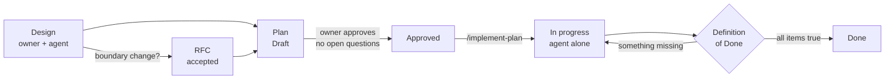
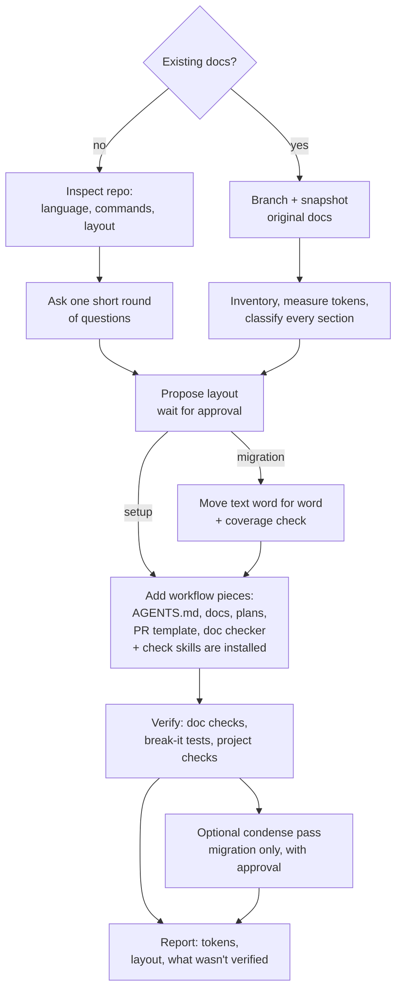

> [!abstract] TL;DR
> A way to structure a repo's docs so a coding agent loads a **small contract** by default and **routes itself** to deeper docs only when needed. Paired with a four-stage workflow — **design → plan → implement → finish** — where the owner and agent design a unit of work together, then an agent implements it alone and finishes with a **Definition of Done**. Tests keep the docs accurate.
>
> Built and first used with [[Claude Code]] on a solo TypeScript / Postgres project (a personal finance dashboard).

> [!info] Status
> **Set up, not yet battle-tested.** The skills below had not been run on a real unit of work when this was written. How I plan to test whether it actually helps agents is in [[Testing Documentation-Routed Agentic Coding]]; results go in the [[#Evaluation log]].

## How it works in practice

Here's what a working session looks like. The rest of the page explains the structure that makes it work.

> [!example] One-time setup
> 1. **Install the skills once** for your user: clone [doc-routed-agentic-coding](https://github.com/nbaradar/doc-routed-agentic-coding) and run `./install.sh --link`.
> 2. **In each repo, run `/adopt-routed-workflow`.** It sets up the structure from scratch, or migrates your existing docs into it without losing anything. See [[#Adopting it in any repo]].

1. **Open the repo in a new chat session.** The agent automatically loads a small contract (`AGENTS.md`) and nothing else.
2. **Run `/project-status`.** A few lines: what was last built, what's in progress, which plans are waiting (including Drafts and how many open questions each has), and what needs you.
3. **Run `/plan-unit` and design the next piece together.** You and the agent agree on scope, what's out of scope, and the key decisions; the agent writes it up as a plan. Planning doesn't have to finish in one session: `/plan-unit 0003` picks a Draft back up later.
4. **Approve the plan.** The agent summarises the plan and asks you to **Approve**, **Revise**, or **Keep as Draft**. Nothing gets built until you approve.
5. **Open a fresh session and run `/implement-plan <n>`.** The agent works through the plan on its own, running tests and checks, and stops only when the plan says to or when reality contradicts it.
6. **Review and merge.** The agent finishes by updating the project's status and history docs and marking the plan Done, then reports anything it couldn't verify. You review the PR against a checklist and merge.

> [!tip] What changes compared with ad-hoc prompting
> - **You spend your attention on design, not supervision.** The back-and-forth happens once, while planning. Implementation runs without you.
> - **Every session starts small.** The agent loads about 5k tokens of rules and routing instead of the whole project's history, then opens only the docs the task needs.
> - **Nothing falls through the cracks at the end.** A checklist, backed by tests, makes the agent update status, history, and docs before calling the work finished.
> - **Fresh sessions are a feature.** Because the plan holds the context, a new session for implementation works well, and it exposes gaps in the plan.

## The problem

My agent guidance had grown into two big files: `AGENTS.md` (rules plus a running changelog) and `PLAN.md` (vision plus a phase log). The agent loaded both at the start of every session:

- **~26,500 tokens** before any work began, mostly history the agent didn't need
- a rule saying *"update both files after every change"* that made them **grow with every unit of work**
- no clean way to **design something together, write it down, and hand it to an agent** to implement on its own

## The core idea

Split documentation into three layers, and let a routing system decide what gets loaded when.

| Layer | What | When it loads |
|---|---|---|
| **Contract** | `AGENTS.md`: rules that always apply + a routing table | Every session |
| **Topic docs** | `docs/…`: each has a small header describing itself | On demand, via routing |
| **Work artifacts** | RFCs (*why*), plans (*how*), status (*now*), history (*then*) | When working a unit |

> [!tip] One fact, one owner
> Every fact lives in exactly one document. Everything else **links** to it instead of copying it. Most documentation bloat is the same fact copied into three places.

## Repository layout

```text
CLAUDE.md                 "@AGENTS.md", so Claude Code loads the contract automatically
AGENTS.md                 rules + "Where to look" routing table + workflow + Definition of Done
PLAN.md                   vision, non-goals, phases, open decisions
README.md                 for humans: capabilities table, setup, troubleshooting
docs/
  README.md               full index: each doc and when to read it
  status.md               current state + next plan (replaced each unit, never appended)
  history.md              one dated entry per completed unit
  architecture/           overview, data model, modules, security, safety, UI, hosting…
  decisions/              RFCs / ADRs + index and conventions
  plans/                  implementation plans + TEMPLATE.md + index with statuses
  future/                 deliberately deferred work
.github/pull_request_template.md
tests/documentation.test.mjs
```

The skills are **not** in the project. They're installed once for your user, in `~/.claude/skills/`, and work in every repo; see [[#Rules vs procedures]].

### Who reads what

| File | Audience | Loaded |
|---|---|---|
| `AGENTS.md` | Agents | Every session (via `CLAUDE.md`) |
| `docs/*` | Agents | When the routing table or index points there |
| `PLAN.md` | Owner + agents | When planning or checking the roadmap |
| `README.md` | Owner / GitHub | Agents only for troubleshooting, or when updating it |

> [!note] Claude Code quirk
> Claude Code reads `CLAUDE.md`, not `AGENTS.md`. A one-line `CLAUDE.md` containing `@AGENTS.md` keeps the shared `AGENTS.md` convention (read by Codex, Cursor, and others) working in Claude Code too.

## Rules vs procedures

The workflow is split into layers so the repo **describes itself**, whatever tool is reading it:

| Layer | Holds | Lives in | Required? |
|---|---|---|---|
| **Rules** | Stages, the approval requirement, Definition of Done, doc discipline, routing | The project's `AGENTS.md` | Yes. Always loaded, and read by any agent (Claude Code, Codex, Cursor…) |
| **Details** | Plan lifecycle, templates | `docs/plans/`, templates | Yes. Read when planning |
| **Enforcement** | Headers, indexes, links, plan statuses | The doc checker | Yes. Catches drift |
| **Procedures** | Step-by-step, interactive ways of following the rules | Skills, installed per user | No. Shortcuts that make the rules easy to follow |

A quick fix made without any skill, or by a tool that doesn't support Claude Code skills, still gets told to update `status.md` and `history.md`, because that rule lives in `AGENTS.md`. The skills are generic and **defer to `AGENTS.md`** for anything project-specific (check commands, which changes need an RFC), so one copy serves every project.

> [!tip] One copy, symlinked
> The skills live in a single repo. `./install.sh --link` symlinks each one into `~/.claude/skills/`, so editing a skill in any project edits the repo's file, and `git status` shows the change ready to commit. Keep project copies out: a project skill and a personal skill with the same name conflict.

## Routing: how the agent finds context

Two layers, similar to how skills work: the agent reads short descriptions, then decides what to open.

### 1. A routing table in `AGENTS.md`

```markdown
| Working on…                        | Read first                                        |
|------------------------------------|---------------------------------------------------|
| What to build next                 | docs/status.md, then the plan it names            |
| Designing a unit of work           | docs/plans/README.md, docs/plans/TEMPLATE.md      |
| Ledger schema, money, transactions | docs/architecture/ledger-model.md, RFC 0001       |
| Connectors, sync, provider access  | docs/institutions.md, RFC 0003, RFC 0004          |
| Local setup failures               | README.md, Troubleshooting section only           |
| Anything else                      | docs/README.md (full index)                       |
```

Paths are **plain text, not Markdown links**. The file is for the model; plain paths cost fewer tokens and read just as well.

### 2. A header on every doc

```yaml
---
summary: What this document covers
read_when: The situations in which an agent should open it
---
```

`docs/README.md` is a list of each document and its `read_when`. The agent scans those one-liners the same way it scans skill descriptions.

## The workflow



1. **Design** *(together)*. If the unit changes an architectural boundary (e.g., a new core table), write an **RFC** first and accept it.
2. **Plan** *(together)*. `/plan-unit` writes `docs/plans/NNNN-title.md` from the template. It stays **Draft** until its *Open questions* section is empty **and you explicitly approve it**: the skill summarises the plan and asks you to Approve, Revise, or Keep as Draft.
3. **Implement** *(agent alone)*. `/implement-plan NNNN` refuses anything not **Approved**, sets it **In progress**, loads the plan's required reading, and builds it.
4. **Finish** *(agent alone)*. Runs the **Definition of Done** before saying it's finished.

> [!important] Plan lifecycle
> `Draft → Approved → In progress → Done` (or `Superseded`). At most **one** plan is in progress at a time, and `status.md` links to it.

### The plan template

Every section exists so the implementing agent can work **without asking**:

| Section | Purpose |
|---|---|
| **Goal** | What becomes true when it's done |
| **Scope / Non-goals** | Non-goals are a *hard boundary* |
| **Required reading** | Specific docs and code, and what to look for in each |
| **Decisions already made** | Settled choices the agent must not ask about again |
| **Open questions** | Must be empty before approval |
| **Steps / Acceptance criteria** | Ordered steps; checkable boxes |
| **Tests required / Verification** | Behaviours to prove; commands to run |
| **Documentation to update** | A checklist specific to this unit |
| **Stop and ask if** | Halt conditions specific to this unit |
| **Completion record** | Date, verified counts, deviations, what wasn't verified, follow-ups |

> [!tip] The two sections that make agents autonomous
> **Decisions already made** stops the agent from asking again. **Non-goals** stops it drifting into neighbouring work.

### Definition of Done

Lives in `AGENTS.md`, so every agent sees it, even without the skill:

- [ ] Plan acceptance criteria met and checked off
- [ ] Format, lint, typecheck, tests, and build pass (+ integration tests / schema-drift checks when relevant)
- [ ] Every doc in the plan's *Documentation to update* is updated
- [ ] `status.md` **replaced**, not appended; `history.md` gets **one** dated entry
- [ ] README updated if a user-visible capability, setup step, or known problem changed
- [ ] Plan set to **Done**, with its Completion record
- [ ] Anything unverified (e.g., *"UI not tried in a browser"*) is stated explicitly

> [!warning] Why "replace" and "one line" matter
> *"Update X after every change"* grows X forever. **Replace** current-state files and **append one line** to logs; that's what stops the always-loaded context from growing again.

## The skills

> [!example]- `/plan-unit`: design → plan, or resume a Draft
> - **Start or resume:** `/plan-unit NNNN` reopens that plan. With no number and existing Drafts, it asks whether to resume one or start fresh. Approved or later plans aren't reopened without your go-ahead, and Done plans are never rewritten.
> - **When resuming,** it summarises where the plan stands, **re-checks it against the current code and docs** (a Draft can go stale), takes the open questions first, and edits the plan in place, keeping its number
> - Gathers context through the routing table; opens only relevant docs and code
> - Recommends **one** smallest cohesive unit (not a survey of options)
> - Asks only questions whose answers change the plan
> - Drafts an RFC if a boundary changes and gets it accepted first
> - Writes the plan from the template, updates the plans index and `status.md`, and runs the doc checks
> - **Approval gate:** if open questions remain, it lists them and keeps the plan Draft. Otherwise it summarises goal, scope, non-goals, key decisions, and acceptance criteria, and asks you to **Approve**, **Revise**, or **Keep as Draft**. It never approves a plan on its own judgment.
> - On approval: sets `Status: Approved` with the date, updates the index and status, and tells you the next step: `/implement-plan NNNN`, ideally in a fresh session

> [!example]- `/implement-plan <n>`: implement → finish
> - Refuses a plan that isn't **Approved**, or when another plan is **In progress**
> - Loads the plan's required reading and related RFCs
> - Follows *Decisions already made*; treats *Non-goals* as hard limits
> - Keeps out-of-scope work as follow-ups instead of doing it
> - **Stops** when reality contradicts the plan, instead of quietly redesigning
> - Runs verification, checks off criteria only when proven, completes the Definition of Done
> - Reports what was built, verified counts, what wasn't verified, deviations, and follow-ups

> [!example]- `/project-status`: a cheap status report
> Reads **only** `status.md`, the plans index, the last two history entries, and `git log` / `git status`. For Draft plans it counts the open questions with a single shell command instead of opening each plan file, so it can tell a Draft that's blocked on questions from one that only needs your approval. Outputs at most about 12 lines:
> ```text
> Last built:  …
> In progress: …
> Plans:       …
> Next up:     …
> Needs you:   … (Drafts awaiting answers or approval: /plan-unit NNNN)
> Repo:        …
> ```

## Enforcement: tests that keep the docs accurate

A documentation test file runs with the normal unit tests and **fails** when:

- a doc is missing its `summary` / `read_when` header
- a doc isn't listed in an index
- a relative link, or a path named in `AGENTS.md`, points to a missing file
- a plan's status is invalid, or doesn't match the plans index
- an Approved (or later) plan still has open questions
- more than one plan is In progress, or `status.md` doesn't link the one that is
- `CLAUDE.md` stops loading `AGENTS.md`

> [!caution] Limitation
> Tests check **structure**, not **content**. Nothing proves `status.md` was updated *meaningfully*; that still depends on the checklist, the skill, and a human reviewing the PR against the template.

## Adopting it in any repo

I packaged the whole setup in a public repo, **[doc-routed-agentic-coding](https://github.com/nbaradar/doc-routed-agentic-coding)**, with four skills: **`/adopt-routed-workflow`** plus the three workflow skills. Clone it and run `./install.sh --link` to install them for your user; they then work in every project.

### Two modes

The skill picks a mode first and tells you which one it chose.

| | **Setup mode** | **Migration mode** |
|---|---|---|
| **When** | No meaningful docs (at most a stub README or a generated `CLAUDE.md`) | Existing agent or project docs worth keeping |
| **What it does** | Creates the structure from scratch | Moves existing docs into the structure, then adds the workflow |
| **Asks you** | What the project is, hard rules, what's high-risk, the first thing to build | Approval of the proposed layout and where each existing section goes |
| **Guarantee** | Invents no topic docs you didn't give it content for | Nothing is lost, proven line by line |

Borderline cases, like a single short `CLAUDE.md`, get migration mode: it costs little and guarantees existing text survives.

### What it does, step by step



1. **Preconditions:** a new branch, never the default one. In migration mode, a snapshot of the original docs.
2. **Assess:** inventory every doc, measure what loads by default, find the project's check commands, and sort each section into *rule / topic reference / rationale / roadmap / status / history / for humans / out of date*.
3. **Propose a layout and wait for approval.**
4. **Migration only:** move text word for word with a script, then prove coverage.
5. **Add the workflow pieces** from templates, adapted to the project's names and commands. It doesn't copy skills into the project; it checks the workflow skills are installed and points you to `install.sh` if not.
6. **Verify:** the doc checks pass *and* fail when something is broken on purpose; the project's own checks still pass.
7. **Optional condense pass** (migration only, with approval).
8. **Report:** tokens before and after, the new layout, what was corrected, what wasn't verified, and a suggested commit message.

### What's in the repo

```text
install.sh                  installs the skills for your user (copy, or --link)
skills/
  adopt-routed-workflow/
    SKILL.md                the instructions (~1,500 words, loaded only when invoked)
    templates/
      layout.md             default layout + where each kind of existing content goes
      AGENTS.md             contract skeleton: routing, workflow, Definition of Done
      docs-README.md, status.md, history.md, decisions-README.md
      plans-README.md, plan-TEMPLATE.md, pull_request_template.md
    scripts/
      check-docs.mjs        dependency-free doc checker (settings block at the top)
      coverage.py           proves a migration lost nothing
      measure.py            estimates tokens (characters ÷ 4)
  project-status/           short status report
  plan-unit/                design → plan → approval, or resume a Draft
  implement-plan/           implement an approved plan → Definition of Done
```

Repo: [https://github.com/nbaradar/doc-routed-agentic-coding](https://github.com/nbaradar/doc-routed-agentic-coding)

> [!tip] Lessons from doing the first migration by hand
> 1. **Move text word for word first; condense later.** A script that copies line ranges makes the move mechanical and reviewable.
> 2. **Prove nothing was lost.** Compare every non-blank line of the originals against the new files, and explain each mismatch: formatting, a renamed heading, a rewritten link, a recorded duplicate, or out-of-date content you chose to correct.
> 3. **Drop only exact duplicates** during the move.
> 4. **Condense in a separate pass,** starting with what loads by default.
> 5. **Measure** before and after.

## Results

> [!success] Context loaded at session start dropped ~76%

| What loads | Before | After |
|---|---|---|
| Session start | ~26,500 tokens | **~6,300** (−76%) |
| `AGENTS.md` alone | ~10,700 | **~3,700** (−65%) |
| Planning session starting set | — | **~5,550** |
| History / changelog doc | ~9,700 | **~4,400** (−55%) |
| All documentation | ~50,800 | ~55,300 (+9%, none loaded by default) |

*Estimates: characters ÷ 4, not tokenizer counts.*

## Changelog

- **2026-09-25:** First version of the workflow. Later that day:
  - Added an explicit **approval gate** to `/plan-unit`.
  - Added the `/adopt-routed-workflow` skill, with setup and migration modes.
  - `/plan-unit` can **resume a Draft** (`/plan-unit NNNN`), re-checking it for staleness before continuing.
  - `/project-status` shows each Draft's **open-question count** without opening plan files, and lists Drafts under *Needs you*.
  - The three workflow skills became **generic, per-user skills** in the public repo, symlinked into `~/.claude/skills/` from a single copy and no longer stored in projects. The workflow's rules stay in each project's `AGENTS.md`; see [[#Rules vs procedures]].

## Lessons learned

- **Changelogs don't belong in always-loaded files.** Git and a history doc already hold that.
- **Formatters can quietly inflate tokens.** Prettier padded every Markdown table cell to the widest one; switching an index from a table to a list saved ~60%.
- **Keep human docs and agent docs separate.** The README is for people; agents open it only for troubleshooting.
- **Write rules and reasoning in different places.** Rules go in the always-loaded contract; the reasoning goes in topic docs the agent opens when it needs the *why*.
- **Tell agents what's already decided.** Most mid-task interruptions are the agent asking about something already settled.

## Evaluation log

Method: [[Testing Documentation-Routed Agentic Coding]].

> [!question] To fill in as I test this against other workflows
> | Metric | Result |
> |---|---|
> | Units run | |
> | Finished without asking me anything? | |
> | Stops, and were they justified? | |
> | Docs actually updated at the end? | |
> | Planning time vs. implementation time | |
> | Tokens / cost per unit | |
> | Where the plan template fell short | |
> | Compared with other workflows | |
