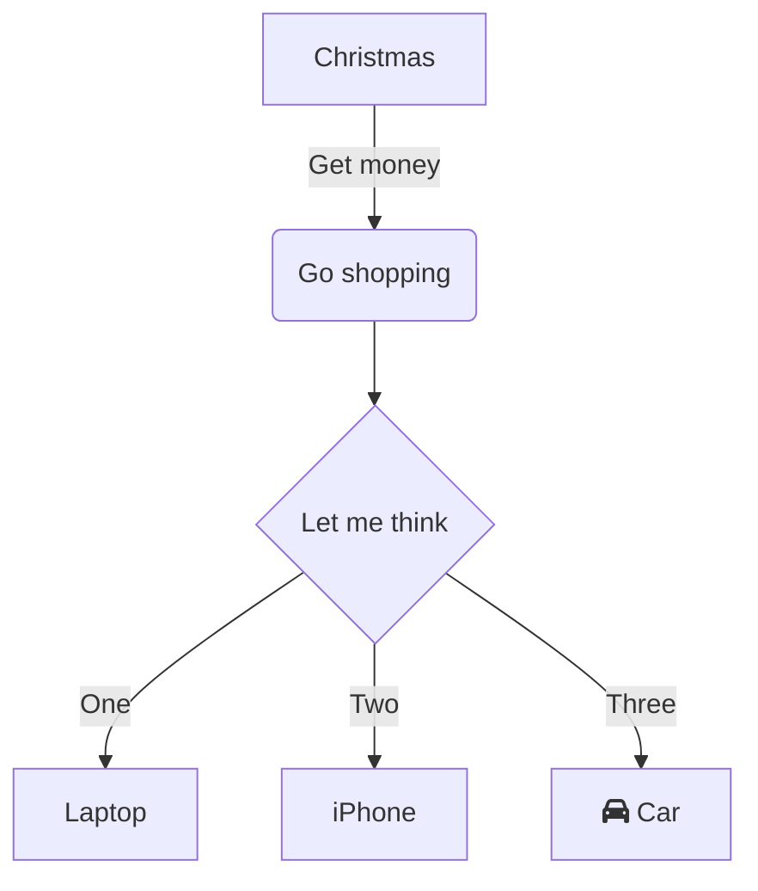

# Callouts
## Foldable Callouts
You can make a callout foldable by adding a plus `(+)` or a minus `(-)` directly after the type identifier.
A plus sign expands the callout by default, and a minus sign collapses it instead.

Example:
> [!faq]- Are callouts foldable? 
> Yes! In a foldable callout, the contents are hidden when the callout is collapsed.
```md
> [!faq]- Are callouts foldable? 
> Yes! In a foldable callout, the contents are hidden when the callout is collapsed.
```

## Callout Types
> [!note]
> `> [!note]`

> [!abstract] Abstract, Summary, Tldr
> `> [!abstract] `

> [!info] Info, Todo
> `> [!info]`

> [!tip] Tip, Hint, Important
> `> [!tip]`

> [!success] Success, Check, Done
> `> [!success]`

> [!question] Question, Help, FAQ
> `> [!question]`

> [!warning] Warning, Caution, Attention
> `[!warning]`

> [!failure] Failure, Fail, Missing
> `> [!failure]`

> [!danger] Danger, Error
> `> [!danger]`

> [!bug]
> `> [!bug]`

> [!example]
> `> [!example]`

> [!quote] Quote, Cite
> `> [!quote]`

# Tasks
https://publish.obsidian.md/tasks/Introduction
obsidian://show-plugin?id=obsidian-tasks-plugin
https://ryan.himmelwright.net/post/started-using-obsidian-tasks-plugin/

# Bases
A [core plugin](https://help.obsidian.md/plugins) that lets you turn any set of notes into a powerful database.
https://help.obsidian.md/bases

# Diagrams
Normally I use [Excalidraw](https://github.com/zsviczian/obsidian-excalidraw-plugin) for diagrams, but you can also use [Mermaid](https://help.obsidian.md/advanced-syntax#Diagram)
If you want to [test out a mermaid diagram](https://mermaid.live/edit#pako:eNpVjU1vgkAQhv_KZk5tgkStfO2hSYXWi0l78FTwMJGRJcouWZZYC_z3LhjTdi7z8T7vOx0cVE7A4XhWl4NAbdguySSz9ZLGQpeNqbDZs9nsud-QYZWSdO3Z-mGjWCNUXZeyeLzx6xFicbcdMWJGlPI03KR48r9L6lmSbrE2qt7_VXYX1bPXtPwQNv6_IjRZ11t6RH7E2QE1i1FPCDhQ6DIHbnRLDlSkKxxX6EY1AyOoogy4HXPUpwwyOVhPjfJTqepu06otBNjsc2O3ts7RUFJiofEXIZmTjlUrDfBFMEUA7-AL-CpcuX4U-cE88D1vGXkOXIH7vhsulit7GZvnPQ0OfE8_524YeMMPR0Fy5Q) on their site

Example Diagram:

